# Genesys Cloud Open Messaging Connector for Snapchat for Business

A production-ready Node.js middleware service that bridges **Snapchat for Business (Snapchat Ads Manager / Business API)** direct messaging with **Genesys Cloud Contact Center via Open Messaging REST API v2**.

This connector handles bi-directional messaging (text, image Snaps, and video Snaps), Snapchat OAuth 2.0 automatic token refreshes, HMAC webhook signature verification, and payload transformations.

---

## Architecture Diagram

The diagram below illustrates the end-to-end architecture and message flow between Snapchat Users, the Connector Middleware, and Genesys Cloud.

```mermaid
sequenceDiagram
    autonumber
    actor Customer as Snapchat User
    participant SnapAPI as Snapchat Business API
    participant Middleware as Node.js Connector Middleware
    participant GenesysAPI as Genesys Cloud Open Messaging API v2
    actor Agent as Genesys Contact Center Agent

    box DarkGrey Snapchat Platform
    participant Customer
    participant SnapAPI
    end

    box DimGray Express Middleware Layer
    participant Middleware
    end

    box DarkGrey Genesys Cloud Platform
    participant GenesysAPI
    participant Agent
    end

    %% Inbound Flow
    rect rgb(30, 41, 59)
    note over Customer, Agent: Inbound Message Flow (Snapchat -> Genesys Cloud)
    Customer->>SnapAPI: Sends Snap (Text / Photo / Video)
    SnapAPI->>Middleware: POST /webhooks/snapchat (Webhook Event)
    activate Middleware
    Middleware->>Middleware: Verify HMAC SHA-256 Signature (x-snap-signature)
    Middleware->>Middleware: Map Snapchat event to Genesys Open Messaging Schema
    Middleware->>GenesysAPI: POST /api/v2/conversations/messaging/integrations/open/{id}/inbound/open
    deactivate Middleware
    GenesysAPI->>Agent: Route interaction to Agent Workspace
    end

    %% Outbound Flow
    rect rgb(15, 23, 42)
    note over Customer, Agent: Outbound Message Flow (Genesys Cloud -> Snapchat)
    Agent->>GenesysAPI: Sends reply to customer
    GenesysAPI->>Middleware: POST /webhooks/genesys (Outbound Webhook)
    activate Middleware
    Middleware->>Middleware: Verify Secret Header (x-genesys-token)
    
    alt Token Expired or Missing
        Middleware->>SnapAPI: POST /login/oauth2/access_token (Refresh Token)
        SnapAPI-->>Middleware: Return new Access Token
    end

    Middleware->>Middleware: Map Genesys payload to Snapchat Direct Message format
    Middleware->>SnapAPI: POST /organizations/{orgId}/messaging/conversations/messages
    deactivate Middleware
    SnapAPI->>Customer: Deliver Direct Message / Snap
    end
```



---

## Features

- **Bi-Directional Messaging**: Full support for text messages, photo Snaps, and video Snaps.
- **Auto-Refresh Snapchat OAuth 2.0**: Axios interceptor handles OAuth token expiration automatically before executing API calls.
- **HMAC & Secret Verification**: 
  - Validates Snapchat incoming webhooks using HMAC-SHA256 signature checks (`x-snap-signature`).
  - Validates Genesys Cloud outbound webhooks via configurable secret token header (`x-genesys-token`).
- **REST API v2 Compliant**: Aligned with the latest Genesys Cloud Open Messaging v2 specification.
- **Container-Ready**: Built-in Dockerfile with alpine base image and container health-check endpoint (`/health`).

---

## Folder Structure

```text
genesys-snapchat-connector/
├── config/
│   └── default.js                 # Environment variable configurations & defaults
├── src/
│   ├── services/
│   │   ├── genesysService.js      # Genesys Cloud Open Messaging API v2 integration
│   │   └── snapchatService.js     # Snapchat Business API client, HMAC, and OAuth logic
│   ├── utils/
│   │   ├── mapper.js              # Inbound & outbound payload mapping matrix
│   │   └── logger.js              # Structured JSON application logger
│   └── server.js                  # Express server, webhook endpoints, healthcheck
├── config-templates/
│   └── genesys-integration-config.json  # Genesys Integration schema configuration
├── .env.example                   # Environment variable template
├── Dockerfile                     # Multi-stage production Docker container configuration
├── package.json                   # Project dependencies and scripts
└── README.md                      # Documentation
```

---

## Environment Variables

Copy `.env.example` to `.env` and fill in your credentials:

```ini
# Server Configuration
PORT=3000
NODE_ENV=production

# Snapchat Business API Settings
SNAPCHAT_CLIENT_ID=your_snapchat_client_id
SNAPCHAT_CLIENT_SECRET=your_snapchat_client_secret
SNAPCHAT_REFRESH_TOKEN=your_snapchat_refresh_token
SNAPCHAT_ORGANIZATION_ID=your_snapchat_org_id
SNAPCHAT_WEBHOOK_SECRET=your_snapchat_webhook_hmac_secret

# Genesys Cloud Settings
GENESYS_ENVIRONMENT=mypurecloud.com
GENESYS_INTEGRATION_ID=your_genesys_open_messaging_integration_id
GENESYS_OUTBOUND_SECRET=your_genesys_outbound_webhook_token
```

---

## Quick Start

### 1. Local Development

```bash
# Install dependencies
npm install

# Start development server with hot-reload
npm run dev
```

### 2. Docker Deployment

```bash
# Build Docker image
docker build -t genesys-snapchat-connector .

# Run container
docker run -d -p 3000:3000 --env-file .env --name snapchat-connector genesys-snapchat-connector
```

---

## Endpoints

| Method | Endpoint | Description |
| :--- | :--- | :--- |
| `GET` | `/health` | Healthcheck endpoint for K8s / Docker container monitors |
| `POST` | `/webhooks/snapchat` | Webhook target for inbound Snapchat direct messages |
| `POST` | `/webhooks/genesys` | Webhook target for outbound agent messages from Genesys |

---

## Genesys Cloud Integration Setup

1. In **Genesys Cloud Admin**, navigate to **Admin > Message > Open Messaging**.
2. Create a new Open Messaging Integration:
   - **Outbound Notification Webhook URL**: `https://<your-domain>/webhooks/genesys`
   - **Secret Token Header**: `x-genesys-token`
   - **Secret Token**: Matches `GENESYS_OUTBOUND_SECRET` in `.env`
3. Copy the generated **Integration ID** into `GENESYS_INTEGRATION_ID` in your environment settings.

[](https://www.buymeacoffee.com/bhargavbhatt)
